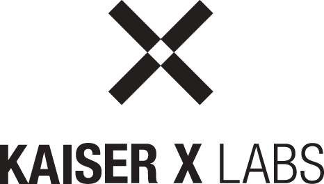

<p align="center">
  <a href="https://www.kaiser-x.com/" rel="noopener" target="_blank"></a>
</p>

# @inno/lego-service

A dummy repo which can be used to debug stuff. It was initially created to verify if some guard is behaving differently on the DGi prodcution cluster than on local. It can easily be deployed from your local machine without going the detour on the `orchestration` repo. In case something need's to be tested quick and isolated, this could help. 

# Workflow

Here are the steps one need to deploy any change on that service.

## Build Docker Image

Make sure to set the target platform for the docker image. Especially if you are running on a M1 machine, this could otherwise lead to an error. 

```
docker build --file ./Dockerfile -t innoplatform.azurecr.io/lego-service . --platform=linux/amd64
```

## Push Docker image to Azure 

```
docker push innoplatform.azurecr.io/lego-service
```

### Install Helm Charts

```
helm upgrade --install --namespace=inno-kxl-production lego-service ./helm -f ./helm/values.yaml --set image-tag=<tag>
```


